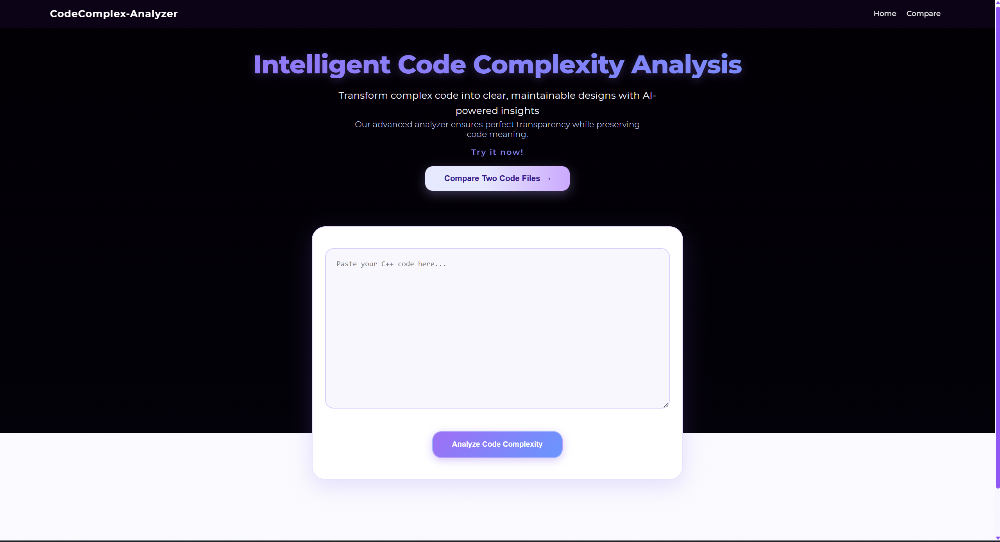
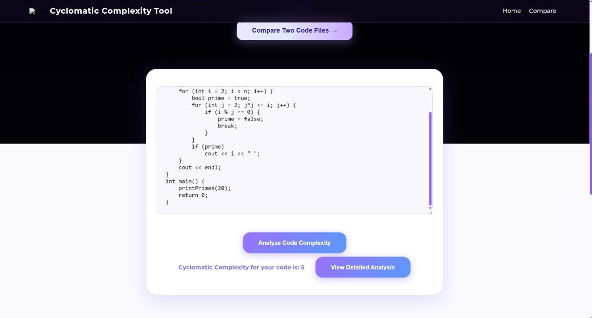
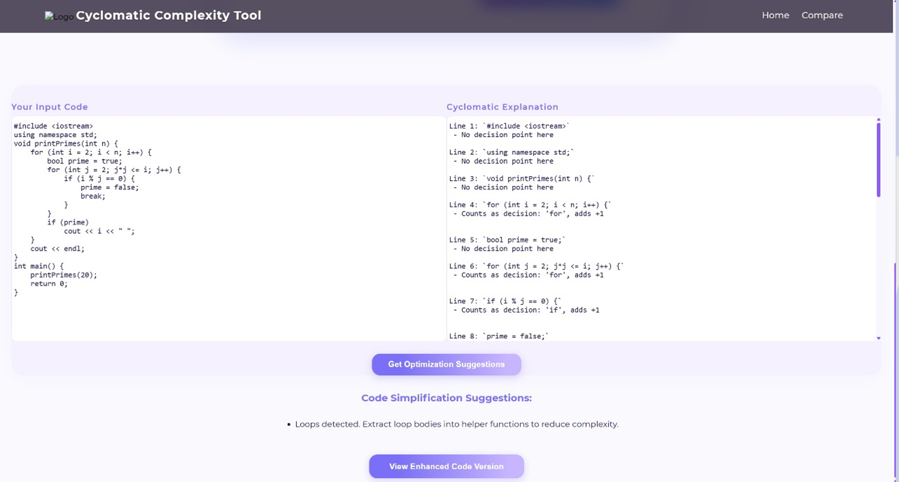
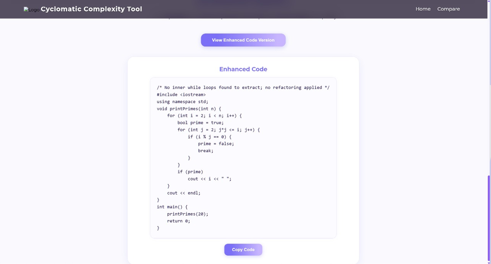
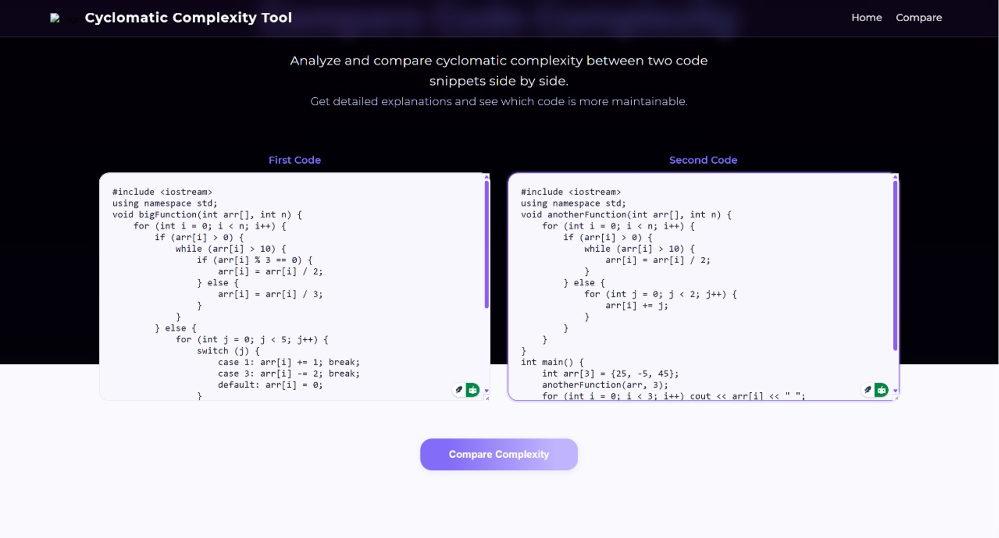
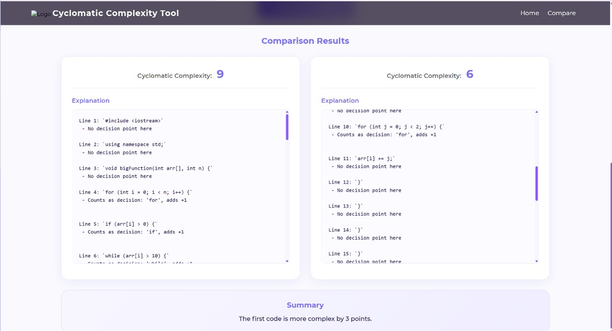

# 📊 C++ Cyclomatic Complexity Analyzer

A web-based tool that analyzes **Cyclomatic Complexity** of C++ source code using **McCabe’s method**.  
The application helps developers **measure, compare, understand, and reduce code complexity**, thereby improving maintainability and overall code quality.

---

## 🔍 What is Cyclomatic Complexity?

Cyclomatic Complexity measures the **number of independent execution paths** through a program.

**Formula used:**
Cyclomatic Complexity = Decision Points + 1


**Decision points include:**
- `if`
- `for`
- `while`
- `case`
- Ternary operator `?:`

Higher cyclomatic complexity implies:
- Harder testing
- Lower maintainability
- Higher probability of defects

---

## 🚀 Features

- Computes cyclomatic complexity for any C++ program  
- Provides line-by-line explanation of decision points  
- Allows side-by-side comparison of two C++ code snippets  
- Highlights the more maintainable (lower complexity) code  
- Detects deep nesting and large functions  
- Suggests and applies basic refactoring  
- Real-time analysis using AJAX  
- Simple and user-friendly web interface  

---

## 🧩 Project Architecture

### 🖥️ Frontend
- HTML5  
- CSS3  
- JavaScript  
- AJAX  

### 🧠 Backend
- Flask (Python)  
- Regular Expressions (`re`) for parsing C++ code  

---

## 🖼️ Application Screenshots & Explanation

### 🟢 Landing Page – Code Input Interface



This is the main interface of the **C++ Cyclomatic Complexity Analyzer**.  
It offers a large text area to paste C++ code and begin complexity analysis.  
An option is also provided to navigate to the code comparison feature for more detailed analysis.

---

### 🟣 Comparison Page – Dual Code Input


This page enables **side-by-side comparison** of cyclomatic complexity for two C++ programs.  
After pasting the code into both input areas, clicking the **Compare Complexity** button starts the analysis.  
The tool determines which version is **easier to maintain**.

---

### 🔵 Single Code Analysis – Example 



The tool examines the supplied C++ code and computes the **cyclomatic complexity score**.  
Decision constructs such as conditional statements and loops are identified during this process.

---

### 🔵 Single Code Analysis – Example  (Line-by-Line Explanation)



This screen presents a **detailed line-by-line breakdown** of the decision points contributing to the overall complexity.  
It helps developers understand how individual lines increase complexity.

---

### 🔵 Single Code Analysis – Example  (Refactoring Suggestions)



Based on the analysis, the tool suggests **specific optimization techniques**.  
If deep nesting or large functions are detected, a **refactored version of the original code** may be generated to improve maintainability.

---

### 🟠 Code Comparison Example



This view displays the **cyclomatic complexity scores** of two C++ code snippets side by side.  
Each score is accompanied by a detailed explanation of contributing decision points.

---

### 🟠 Code Comparison Example -Summary View



A final summary highlights:
- Which code is more complex  
- The difference in cyclomatic complexity values  

This helps developers quickly select the **more maintainable implementation**.

---

## 🔧 How It Works

### 1️⃣ Input Processing
- User submits C++ code via a web form  
- Comments are removed to prevent incorrect complexity counts  

### 2️⃣ Complexity Calculation
- Regular expressions scan for decision keywords (`if`, `for`, `while`, `case`, `?:`)  
- Each detected decision point increases complexity  
- Final complexity = decision points + 1  

### 3️⃣ Comparison & Refactoring
- Two snippets are analyzed independently  
- Lower complexity code is highlighted  
- Refactoring suggestions are generated when required  

---

## ⚙️ Technologies Used

| Category | Technology |
|--------|------------|
| Frontend | HTML, CSS, JavaScript, AJAX |
| Backend | Flask (Python) |
| Parsing | Regex (`re` module) |
| Analysis | McCabe Cyclomatic Complexity |

---

## 🏁 How to Run the Project

```bash
git clone https://github.com/GayathriVijaya/CodeComplex-Analyzer.git
cd CodeComplex-Analyzer
pip install flask
python app.py
Open your browser and navigate to:

cpp
Copy code
http://127.0.0.1:5000/
📌 Use Cases
Quick code reviews

Academic and mini-projects

Learning clean coding practices

Comparing alternative implementations

Identifying refactoring opportunities
